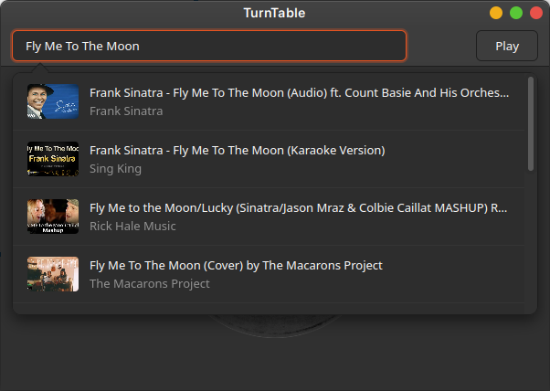
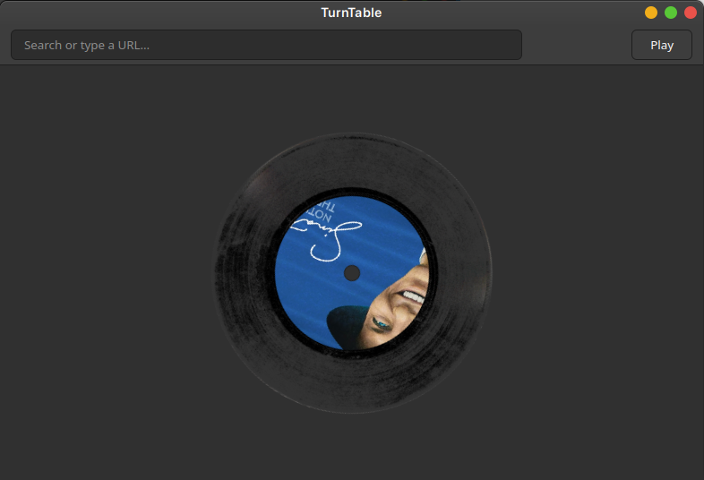

# TurnTable
🇺🇸 Your YouTube music player that simulates perfectly the audio of a turntable with effects including the motor pitch oscillation, the hiss, the crackles and the needle skips.
🇵🇹 Seu reprodutor de música do YouTube que simula perfeitamente o áudio de um toca-discos com efeitos incluindo a oscilação do tom do motor, o chiado, os estalos e os saltos da agulha.

# 🇺🇸 How to Install | 🇵🇹 Como Instalar
1. `git clone https://github.com/SurnameGuy/TurnTable`
2. `cd TurnTable`
3. `./build.sh`
🇺🇸 Enjoy!
🇵🇹 Aproveite!

# 🇺🇸 Screenshots | 🇵🇹 Capturas de Tela

